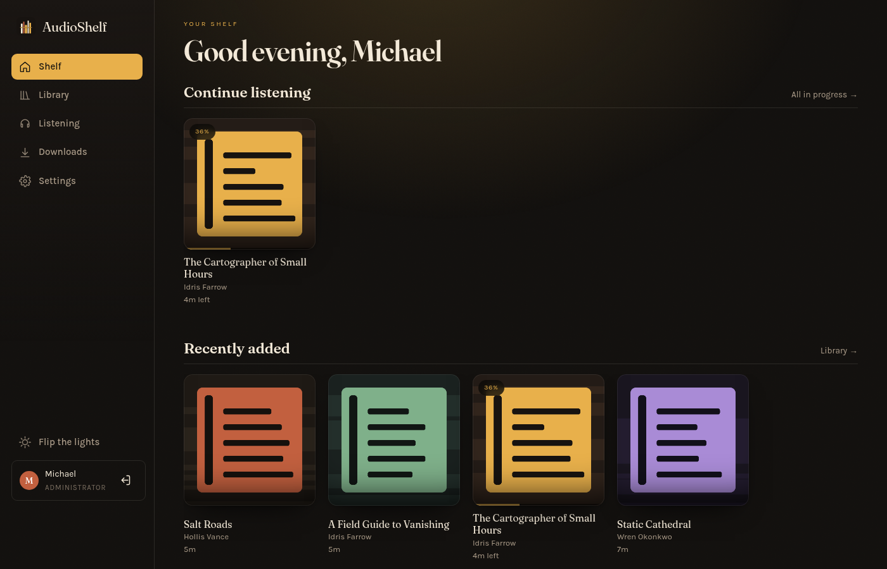
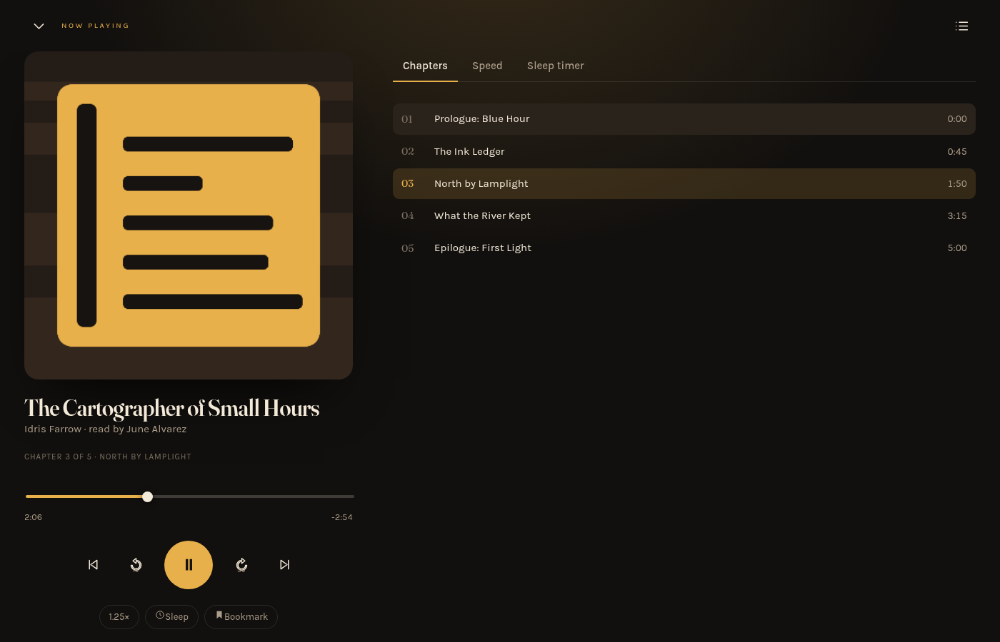
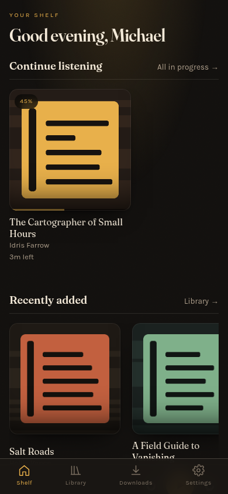
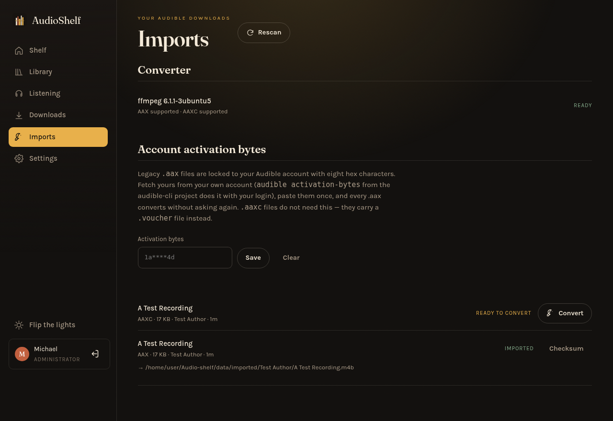
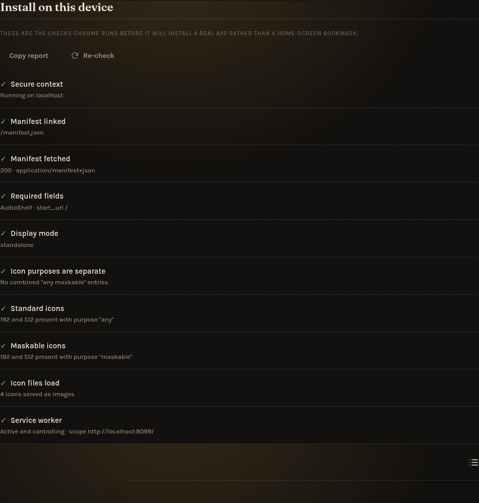

# AudioShelf

A self-hosted audiobook server with an installable, offline-capable PWA player —
your own Audible, running on your own box, reading your own files.

Point it at a folder of audiobooks. It reads the tags, builds a shelf, and serves
a player that remembers your position across every device you sign in on.



| Now playing | On a phone |
| --- | --- |
|  |  |

## What it does

**Library**
- Scans a folder tree of `.m4b`, `.mp3`, `.m4a`, `.flac`, `.opus`, `.ogg`, `.aac`, `.wav`
- Reads title, author, narrator, series, year, genre, description and cover art from tags
- Chapters from embedded `m4b` chapter markers, or one chapter per file for multi-file books
- Incremental re-scans: unchanged books are fingerprinted and skipped
- Watches the library folder, so books you drop in appear on the shelf by themselves
- Drag-and-drop upload from any device, and an API token so scripts and agents can add books too
- Search and filter by title/author/narrator/series, in progress, finished, unstarted

**Player**
- Resumes to the second, per user, across devices — position is stored server-side
- Chapter list with jump-to, ±15s/30s skips, 0.5×–3× speed (remembered per book)
- Sleep timer (fixed minutes or end-of-chapter) with a 15-second fade-out
- Bookmarks with notes
- Lock-screen / car-stereo controls through the Media Session API
- Keyboard: <kbd>space</kbd> play/pause, <kbd>←</kbd>/<kbd>→</kbd> skip

**Offline**
- Installable PWA (iOS, Android, desktop)
- Download a book to the device; the service worker serves it from Cache Storage,
  including byte-range requests, so seeking works with the network off
- Listening position is queued while offline and synced when you reconnect

**Audible imports**
- Finds the `.aax` / `.aaxc` files you downloaded from your own account anywhere in the library
- Converts them to plain `.m4b` with ffmpeg: audio stream copied, never re-encoded, chapters and cover art intact
- One-click from the Imports page, or `npm run cli -- import --all`
- You supply the keys — your account activation bytes for `.aax`, the `.voucher` Audible's downloader
  writes next to each `.aaxc`. AudioShelf never contacts Audible and cannot derive keys for you.

**Multi-user**
- First account created is the administrator; admins add listeners and trigger scans
- Each listener gets their own progress, bookmarks and finished shelf
- scrypt password hashing, HttpOnly session cookies, no third-party services

## Quick start

Requires **Node 22.5+** (it uses the built-in `node:sqlite`, so there is nothing to compile).

```bash
git clone https://github.com/mcroney531-ctrl/Audio-shelf.git
cd Audio-shelf
npm install

# Optional: a demo library of silent, tagged files to click around in
npm run seed:demo

AUDIOSHELF_LIBRARY=/path/to/audiobooks npm start
```

Open <http://localhost:8080> and create the first account — that one is the admin.

### Windows

No Docker needed — AudioShelf is plain Node with no native dependencies. One command does the lot:

```powershell
irm https://raw.githubusercontent.com/mcroney531-ctrl/Audio-shelf/claude/self-hosted-audible-pwa-dhhhoi/install.ps1 | iex
```

`install.ps1` picks a folder you can actually write to, installs Node if it is missing (fixing
`PATH` in the same window, so no reopening the terminal), downloads the project with or without git,
and hands over to `start.ps1`. That in turn installs dependencies, asks where your audiobooks live,
saves the answer to `.env` and prints the address to open. After the first run, `.\start.ps1` is all
you need.

Prefer to do it by hand? Note that **the user profile root is often not writable** — pick somewhere
under Documents:

```powershell
mkdir $HOME\Documents\AudioShelf
cd $HOME\Documents\AudioShelf
git clone -b claude/self-hosted-audible-pwa-dhhhoi https://github.com/mcroney531-ctrl/Audio-shelf.git .
.\start.ps1
```

Things Windows will throw at you:

| Symptom | Fix |
| --- | --- |
| `running scripts is disabled on this system` | `Set-ExecutionPolicy -Scope Process -ExecutionPolicy Bypass` then re-run |
| `could not create work tree dir ... Permission denied` | You are in a folder you cannot write to (often the profile root, or Controlled Folder Access in Windows Security). Use `$HOME\Documents` |
| `node` not recognised right after installing it | `PATH` only refreshes in new terminals — open a new PowerShell, or let `install.ps1` handle it |
| `VAR=value npm start` does nothing useful | That is bash syntax. Use `.env`, or `$env:AUDIOSHELF_LIBRARY = "D:\Audiobooks"` on its own line first |

For the Audible import, add ffmpeg:

```powershell
winget install Gyan.FFmpeg
```

Open a new terminal afterwards so it is on `PATH`.

#### Day-to-day use

You set the library folder once. After that PowerShell is not part of the routine:

- **Adding books** — copy them into your library folder in Explorer. AudioShelf watches that folder
  and rescans a few seconds after the copy finishes; the book appears on the shelf on its own. Or
  drag them onto the **Add books** page from any device, including your phone.
- **Starting it** — run it at logon with no terminal window:

  ```powershell
  .\scripts\install-task.ps1          # registers a scheduled task and starts it
  .\scripts\install-task.ps1 -Remove  # undo
  ```

  After that the server is simply always there at `http://localhost:8080`; bookmark it.
- **Changing the port** — put `AUDIOSHELF_PORT=9000` in `.env` and restart. 8080 is only a default.
- **Changing the library folder** — edit `AUDIOSHELF_LIBRARY` in `.env`, or run
  `.\start.ps1 -Library "E:\Books"` once.

### Docker

```bash
# edit the library path in docker-compose.yml first
docker compose up -d
```

### Install it on your phone

Open the server's URL in the phone's browser, then *Add to Home Screen*. It runs
full-screen, keeps playing with the screen off, and shows up on the lock screen.
For iOS the site must be served over HTTPS (or `localhost`) for the service worker
and downloads to work — put it behind a reverse proxy with a certificate.

## Deploying it somewhere you can reach

**Static hosts cannot run AudioShelf.** Netlify, Vercel, GitHub Pages and Cloudflare Pages serve
files; they do not run a long-lived Node process, and they have no disk to keep your audiobooks,
your SQLite database or your listening position on. Deploying this repo to one of them gives you a
404 (the root has no `index.html` — the app shell lives in `web/`), and pointing the publish
directory at `web/` only moves the failure: the shell loads, calls `/api/setup`, gets a 404 and
stops. AudioShelf needs a host that runs containers or plain Node with persistent storage.

### Option A — your own machine, reachable over a tunnel (recommended)

An audiobook library is tens or hundreds of gigabytes. Storing that on metered cloud disk is the
expensive way to do this; the Windows PC, Mac, Raspberry Pi or NAS the files are already on is the
cheap one. A tunnel then gives you an HTTPS URL — which is also what the PWA install and offline
downloads require.

Start AudioShelf (`.\start.ps1` on Windows, `npm start` or `docker compose up -d` elsewhere), then
put an HTTPS URL in front of it. Neither tool opens a port on your router.

Tailscale needs two things enabled once in the admin console before `serve` works:
**MagicDNS** and **HTTPS Certificates**, both at
[login.tailscale.com/admin/dns](https://login.tailscale.com/admin/dns). Without them the command
fails with an HTTPS error.

```powershell
# Tailscale - private to your own devices, easiest to trust
winget install tailscale.tailscale        # then sign in from the tray icon
tailscale serve --bg 8080                 # https://<machine>.<tailnet>.ts.net
tailscale serve status                    # prints the URL
tailscale funnel --bg 8080                # ...or reachable from anywhere
tailscale serve reset                     # undo

# Cloudflare Tunnel — public URL, no account needed for a quick one
winget install Cloudflare.cloudflared
cloudflared tunnel --url http://localhost:8080
```

On macOS or Linux the same two commands work after `brew install tailscale cloudflared` or your
package manager's equivalent.

On Windows `tailscale serve` needs an elevated PowerShell; if it says access denied, reopen the
terminal as Administrator. The setting persists across reboots.

Then add `AUDIOSHELF_TRUST_PROXY=1` to `.env` so session cookies are marked `Secure` behind the
tunnel, and restart. Phones need the Tailscale app installed and signed into the same account
before the URL resolves.

Cloudflare Tunnel is the alternative when a device cannot run Tailscale, or you want your own
domain. Two things to weigh: traffic passes through Cloudflare's edge rather than going directly
between your devices, and their free plan caps request bodies (around 100 MB at the time of
writing), which is below most audiobooks - so uploads through the tunnel may fail even though
playback is fine. Check their current limits before relying on it.

### Option B — Fly.io

`fly.toml` is in the repo. One volume holds the library, the database and converted imports.

```bash
fly launch --no-deploy --copy-config      # pick your app name and region
fly volumes create audioshelf_data --size 20    # GB — size it for your library
fly deploy

fly ssh console -C "mkdir -p /data/library"
fly sftp shell                            # put local-book.m4b /data/library/Author/Book/
```

### Option C — Render

`render.yaml` is in the repo: point Render at the repo and it builds the Dockerfile. The **disk is
required** — Render's free plan has none, and without it every restart wipes your accounts and
progress. Upload books over SSH once the service is up.

Any VPS with Docker works the same way: `docker compose up -d` plus the reverse proxy config below.

### What every host needs

- **Persistent disk** for `AUDIOSHELF_DATA` (database, covers, instance secret) and for the library.
- **HTTPS**, or the PWA will not install and offline downloads will not work.
- **`AUDIOSHELF_TRUST_PROXY=1`** when something else terminates TLS.
- **No request buffering** in front of it, so byte-range seeks stay responsive (see below).
- **No idle-sleep**, or long streams get cut when the machine suspends mid-chapter.

## How the library should look

One folder per book is the rule. Everything else is a fallback.

```
audiobooks/
├── Idris Farrow/
│   ├── The Cartographer of Small Hours/
│   │   ├── 01 - Prologue.mp3
│   │   ├── 02 - The Ink Ledger.mp3
│   │   └── cover.jpg
│   └── A Field Guide to Vanishing/
│       └── field-guide.m4b            ← single-file book with embedded chapters
└── Salt Roads.m4b                     ← loose files at the root are their own books
```

Tags win over filenames. AudioShelf reads:

| Field | Tag |
| --- | --- |
| Title | `ALBUM` (falls back to the folder name) |
| Author | `ALBUMARTIST`, then `ARTIST`, then the parent folder name |
| Narrator | `COMPOSER` — the convention audiobook taggers use |
| Series | `MOVEMENTNAME`, `GROUPING`, or `TXXX:SERIES` |
| Series index | `MOVEMENT` or `TXXX:SERIES-PART` |
| Description | `DESCRIPTION` or `COMMENT` |
| Cover | Embedded art, else `cover.jpg` / `folder.jpg` / `front.jpg` in the folder |

Multi-file books are ordered by disc/track number, then by natural filename order.

## Adding books from another device

Copying files onto the server is the fastest way to add books, but it is not the only one. The
**Add books** page (admins only) takes drag-and-dropped files, streams them into the library folder,
and the watcher puts them on the shelf. That works from a phone, a laptop, or anything with a
browser.

Optional Author and Title boxes decide which folder the files land in. Tags inside the file still
win over folder names, so a properly tagged book keeps its own title regardless.

### From a script, another machine, or an agent

Create a token under **Settings → API tokens**. It is shown once, stored only as a hash, and carries
the permissions of whoever made it — treat it like a password and revoke it when you are done.

```bash
curl -X POST "https://your-audioshelf/api/upload?name=book.m4b&folder=Author/Title" \
  -H "Authorization: Bearer as_your_token_here" \
  --data-binary @book.m4b
```

The body is the raw file — no multipart envelope — so nothing has to buffer the whole book in
memory at either end. The same token works for the read APIs (`/api/books`, `/api/shelves`).

This is also the answer to "can an AI agent file my audiobooks for me":

- An agent running **on the same machine** (a local Claude Code or Cowork session) does not need any
  of this — it can tag the file and drop it straight into the library folder.
- An agent running **somewhere else** needs a token and a reachable URL, i.e. the tunnel from the
  deploying section. Then the `curl` above is all it takes.

Uploads are limited to audio files, cover images and Audible vouchers, capped at
`AUDIOSHELF_UPLOAD_MAX_GB`, and written to a `.part` file first so a half-finished transfer never
gets scanned.

## Importing your Audible downloads

Audible files are encrypted, so nothing can play them until they are converted. AudioShelf
does that with **ffmpeg** (install it with your package manager; the Docker image includes it)
and with keys that you provide — it has no way to obtain them for you.

| Format | What it needs | Where that comes from |
| --- | --- | --- |
| `.aax` (legacy) | Your account's **activation bytes**, 8 hex characters | Your own account, e.g. `audible activation-bytes` from the [audible-cli](https://github.com/mkb79/audible-cli) project, which signs in as you |
| `.aaxc` (current) | The **key** and **iv** from the file's `.voucher` | Written next to the `.aaxc` by Audible's own downloader — just copy it across with the audio |

Then:

1. Copy the files anywhere inside your library folder (keep each `.voucher` beside its `.aaxc`).
2. Open **Imports** (admins only), paste your activation bytes once — they are stored server-side
   and only ever shown back masked.
3. Hit **Convert**. Progress is live; the finished `.m4b` lands in the imports folder
   (`<data>/imported` by default) and appears on the shelf as soon as the follow-up scan finishes.

The activation-byte lookup tools want the file checksum ffmpeg prints — the **Checksum** button on
each `.aax` row shows it without you having to run ffmpeg by hand.



From the command line:

```bash
npm run cli -- import:activation --set=1a2b3c4d   # store activation bytes
npm run cli -- import:list                        # what was found, and what each file still needs
npm run cli -- import --all                       # convert everything pending
npm run cli -- import --file=book.aax --activation-bytes=1a2b3c4d
npm run cli -- import --file=book.aaxc --voucher=book.voucher
npm run cli -- import:checksum --id=3             # checksum for an activation-byte lookup
```

The original files are left untouched, so nothing is lost if a conversion goes wrong. Once a book
is imported you can delete the `.aax` to reclaim the space.

> Format-shifting works on books you bought. It does not strip anything from books you did not:
> without your own account key, an `.aax` stays a locked file on disk.

## Installing as a real app

On Android there are two very different outcomes that look the same at first: a **WebAPK**
(a real app with its own icon, app-drawer entry and OS identity) and a **bookmark shortcut**
(a Chrome-badged icon that is really just a link). You get the shortcut when the site misses
one of Chrome's installability criteria.

AudioShelf checks all of them itself: **Settings → Install on this device** lists every
criterion with a pass/fail and the exact fix, and shows an **Install app** button the moment
Chrome offers one. Check that page before assuming the install worked.



What matters, and what this repo already does:

- HTTPS (or `localhost`). Plain HTTP over a LAN address will never install — put it behind a
  reverse proxy with a certificate.
- A linked `manifest.json` with `name`, `short_name`, `start_url` and `display: standalone`.
- **Separate** `any` and `maskable` icon entries at 192 and 512 — never one entry with
  `"purpose": "any maskable"`, which can trip Chrome's WebAPK icon resolution and silently
  downgrade the install to a shortcut. The maskable art is a distinct asset with the mark inside
  the inner 80% safe zone (regenerate both with `npm run icons`).
- A registered, controlling service worker.

Verify on the device: Chrome's ⋮ menu should say **"Install app"**, not "Add to Home screen".
For the authoritative answer, connect the phone over USB and open `chrome://inspect` from desktop
Chrome → Application → Manifest, which lists installability errors directly.

**If a badged shortcut is already on the home screen**, fixing the manifest does not repair it —
Chrome caches the verdict per origin:

1. Delete the icon from the home screen.
2. Chrome → ⋮ → Settings → Site settings → find the site → **Delete data / Reset permissions**.
3. Revisit, browse for a few seconds, then check the ⋮ menu for "Install app" before reinstalling.

On iOS, Safari never fires an install prompt: Share → Add to Home Screen is the install, and it
still needs HTTPS for the service worker and offline downloads to work.

## Configuration

Every setting is an environment variable, and any of them can go in a `.env` file in the project
root instead (copy `.env.example` to `.env` and edit). Real environment variables win over the file.

| Variable | Default | Meaning |
| --- | --- | --- |
| `AUDIOSHELF_LIBRARY` | `./library` | Folder to scan |
| `AUDIOSHELF_DATA` | `./data` | Database, covers, instance secret |
| `AUDIOSHELF_HOST` / `AUDIOSHELF_PORT` | `0.0.0.0` / `8080` | Listen address |
| `AUDIOSHELF_SCAN_ON_START` | `1` | Scan when the server boots |
| `AUDIOSHELF_SCAN_INTERVAL_MIN` | `0` | Re-scan every N minutes (0 = never) |
| `AUDIOSHELF_WATCH` | `1` | Watch the library folder and rescan when it changes |
| `AUDIOSHELF_WATCH_DELAY_SEC` | `15` | Quiet period after the last change before rescanning |
| `AUDIOSHELF_UPLOAD_DIR` | the library | Where uploads are written (set this if the library is read-only) |
| `AUDIOSHELF_UPLOAD_MAX_GB` | `8` | Largest single upload |
| `AUDIOSHELF_SESSION_DAYS` | `30` | Session lifetime |
| `AUDIOSHELF_TRUST_PROXY` | `0` | Read `X-Forwarded-Proto` for the Secure cookie flag |
| `AUDIOSHELF_SECRET` | generated | Session signing key; kept in `data/secret` if unset |
| `AUDIOSHELF_IMPORTS` | `<data>/imported` | Where converted Audible books are written (scanned as a second library root) |
| `AUDIOSHELF_FFMPEG` / `AUDIOSHELF_FFPROBE` | `ffmpeg` / `ffprobe` | Only needed for imports, if they are not on `PATH` |

## Command line

```bash
npm run cli -- scan [--force]                                  # rescan the library
npm run cli -- user:add --username=sam --password=... [--admin]
npm run cli -- user:password --username=sam --password=...
npm run cli -- user:list
npm run cli -- stats
npm run cli -- import:list                                     # Audible files found and what they need
npm run cli -- import --all                                    # convert every pending .aax/.aaxc
npm run cli -- import:activation --set=1a2b3c4d
npm test                                                       # integration tests
npm run icons                                                  # regenerate PWA icons
```

## Behind a reverse proxy

Audio is streamed with byte ranges, so disable response buffering:

```nginx
location / {
    proxy_pass         http://127.0.0.1:8080;
    proxy_http_version 1.1;
    proxy_set_header   Host $host;
    proxy_set_header   X-Forwarded-Proto $scheme;
    proxy_buffering    off;        # keep seeking snappy
    client_max_body_size 0;
}
```

Then set `AUDIOSHELF_TRUST_PROXY=1` so session cookies are marked `Secure`.

## How it is built

No frontend framework, no bundler, one runtime dependency.

```
server/     node:http + node:sqlite. config, db, auth, scanner, api, static/range file serving
web/        the PWA: ES modules, hand-rolled hyperscript, service worker, self-hosted fonts
server/audible.js  the ffmpeg wrapper behind .aax/.aaxc imports
scripts/    icon generator, demo library seeder (both dependency-free)
tests/      integration tests against a real server on a temp library
```

- `music-metadata` is the only dependency — it parses the tags.
- Audio is served as-is: no transcoding. Whatever your browser plays, plays. ffmpeg is used only
  to convert Audible downloads, and only when you ask it to.
- The database is a single SQLite file in `AUDIOSHELF_DATA`; back that up and you have
  everything except the audio.

## Deliberate limits

- **No transcoding.** A file your browser cannot decode will not play. Convert it once
  with ffmpeg instead of paying for it on every stream.
- **No key recovery for Audible files.** Imports decrypt with keys you provide from your own
  account; AudioShelf never talks to Audible and cannot crack or look up a key.
- **One library root.** Symlink extra folders into it if you keep books on several disks.
- **No metadata providers.** Titles come from your tags; fix them with a tagger and re-scan.

## Licence

MIT.
